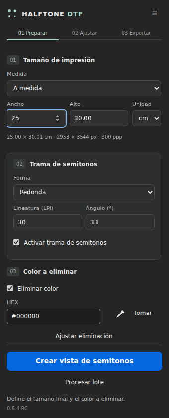
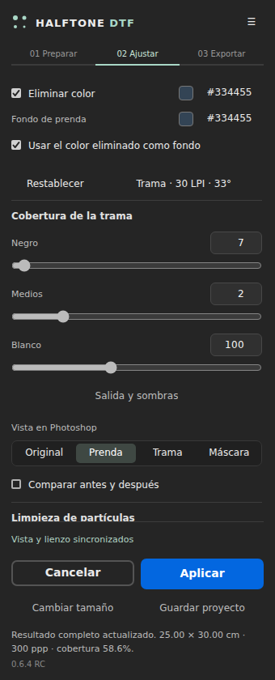

# Halftone DTF — Photoshop UXP · 0.6.4 RC

Panel en español para preparar arte de color con huecos transparentes para DTF. Flujo **Preparar → Ajustar → Exportar**, tamaño proporcional y salida fija a 300 ppp. Destino inicial: Windows / Photoshop 25.0 o superior. Procesamiento local sin dependencias de ejecución. La consulta opcional de versiones usa GitHub y no envía imágenes.

**Candidato de versión.** Las pruebas automáticas usan el motor real y un host Photoshop simulado. Photoshop no está disponible en este entorno: instalación, interfaz UXP, archivos nativos y transferencia física siguen pendientes. El CCX local requiere comprobación y empaquetado oficial antes de distribución estable.

**0.6.4:** controles reales de **Adobe Spectrum Web Components**, con wrappers oficiales para UXP. Panel minimalista: preparación numerada, colores con HEX visible, sliders amplios, opciones avanzadas plegables y acciones siempre visibles. Conserva las optimizaciones de rendimiento de 0.6.3. [Diseño, compatibilidad y pruebas](docs/INTERFAZ-SPECTRUM-0.6.4.md).




Las capturas ejecutan el HTML, CSS y Spectrum compilado en Chromium con host simulado; el slider de Photoshop se representa con un sustituto de prueba. No son capturas de Photoshop.

## Instalación y actualizaciones

La distribución independiente usa un CCX empaquetado con Adobe e instalado por Creative Cloud: el usuario final no necesita Dev Tools. El mantenedor todavía debe producir y validar ese paquete en Windows/Photoshop. Los CCX generados por `npm run package` son candidatos, excluidos de las actualizaciones estables.

**0.6.1 incorpora:** menú de versión/comprobación de releases, acompañante de Windows que instala con Adobe UPIA y registra una tarea por usuario, preparación de fuentes separada para Marketplace y workflow de release con control de evidencia. El acompañante instala solo releases estables completos con Photoshop cerrado y permite desactivar la tarea. No se ha probado una instalación nativa con Adobe en este entorno.

Guía del usuario, activación, diagnóstico y pasos del mantenedor: [Instalación y actualizaciones](docs/INSTALACION-Y-ACTUALIZACIONES.md). Primer paso del mantenedor: `npm run distribution:prepare` y empaquetar `dist/adobe-independent/manifest.json` con UDT. Marketplace requiere la ficha/ID y aprobación de Adobe; no se publica automáticamente desde GitHub.

## 1 · Preparar

El documento abierto se detecta al iniciar. En **☰ → Origen y recorte** puedes elegir capa/composición o actualizar el origen con **Usar documento actual**. Para fuentes incompatibles puedes crear una copia RGB / 8 bits. La lectura y la salida usan sRGB; revisa cambios de gama frente al perfil de producción.

Introduce ancho o alto en **cm o pulgadas**: el otro lado permanece proporcional. Escoge prenda adulta XS–3XL o infantil 2–12 y posición frontal, espalda, pecho izquierdo, manga o nuca. Los presets son áreas orientativas de taller, ajustables por marca/modelo; no constituyen medidas universales. **Medir solo el arte** excluye márgenes transparentes sin recortar el documento original.

Selecciona el color con **Cuentagotas**, que abre el selector nativo de Photoshop y permite tomar una muestra del lienzo. Puedes escribir un HEX y abrir **Ajustar eliminación** para tolerancia/transición. Durante edición se presenta el original al abrir el selector para evitar muestrear la trama. El knockout elimina ese color también dentro del diseño; no es un selector exclusivo del fondo conectado al borde.

Elige forma, lineatura y ángulo. **Crear vista de semitonos** toma una instantánea redimensionada a 300 ppp y crea otra pestaña ya tramada. Mantiene fijados el documento, capa y geometría del origen. Cambiar el documento activo no cambia la fuente.

## 2 · Ajustar

El lienzo de Photoshop es la vista principal. El panel compacto mantiene color, niveles, sombras, cuatro vistas y limpieza. **Trama** muestra forma, LPI y ángulo; **Color** y **Detalles** abren sus parámetros adicionales. **Inspeccionar** conserva el mockup a escala, miniatura, zoom y diagnósticos.

En una instalación limpia, los valores iniciales de referencia son **30 LPI, 33°, forma redonda, entrada 7 / 2 / 100 y salida 0 / 255**. **Restablecer** restablece los cinco niveles. Se conservan preferencias existentes y recetas: estos números son un punto de partida, no una calibración universal.

Los niveles actúan sobre **cobertura**, conservando RGB. Los controles de color modifican RGB por separado. La compensación y el tratamiento de bordes son algoritmos independientes, no una reproducción del algoritmo propietario de DTPrep. Ninguno garantiza restaurar colores que no están en el archivo.

Cambiar un ajuste recalcula desde el origen y actualiza el lienzo al completar la revisión. El inspector opcional puede mostrar primero un detalle provisional. Las revisiones se serializan y prevalece el último valor. No se promete una tasa de cuadros o latencia fija. El cálculo parte siempre de la instantánea sin trama.

### Vistas

**Original / Prenda / Alfa / Máscara** cambian la presentación en el lienzo a resolución final. Comparar añade un divisor antes/después sobre el mismo color de prenda. Las vistas opacas viven en una capa temporal separada; Alfa la retira y muestra la transparencia nativa. Aplicar elimina la capa de vista antes de conservar el resultado. Las vistas auxiliares Eliminado/Protección siguen en el inspector. El color del fondo puede vincularse al knockout o elegirse por separado.

**Imagen completa** ofrece una miniatura general. **Detalle** muestra hasta 512 × 512 píxeles, con navegación X/Y y flechas; la limpieza utiliza halo. **Colocado en prenda** usa una plantilla plana con medidas de pecho/alto y posición del arte a escala. No simula tejido, curvatura, tinta o base blanca. Máscara, eliminación y protección se revisan en detalle, aunque el encuadre seleccionado sea general/prenda.

Solo el inspector opcional utiliza JPEG compuesto: su zoom es visual. Las cuatro vistas principales del lienzo usan píxeles a resolución completa. Para aprobar puntos y píxeles, revisa el documento/PNG al 100% en Photoshop.

### Conservar la edición

**Guardar proyecto editable** crea una carpeta con origen RGBA dimensionado, receta, selección y verificación de integridad por bloques. Puedes reabrirla sin el documento original y cambiar ajustes; no conserva capas, vectores ni la resolución nativa anterior. Para cambiar la medida final vuelve a preparar el original. Guarda el proyecto antes de Aplicar; Aplicar libera la caché de la sesión.

**Aplicar** espera la última revisión y conserva el documento resultante. **Cambiar tamaño / Cancelar** descartan solo la copia de trabajo, incluidas sus ediciones manuales. No edites capas, máscara, opacidad o modo de la copia durante la sesión: la actualización debe controlarla el plugin.

## 3 · Exportar

Exporta una copia PNG. Se comprueba la composición actual: RGB/8 bits, 300 ppp, dimensiones aprobadas, tinta presente y alfa exclusivamente 0/255. Bloquea resultado vacío, cambio de tamaño y semitransparencias añadidas manualmente. El fondo y las vistas no pasan al archivo.

Conserva tamaño y evita remuestrear/suavizar en el RIP después del tramado. El plugin produce una sola máscara para arte de color; no separa CMYK ni controla blanca, choke o perfil RIP.

## Lotes flexibles

Selecciona de 1 a 500 archivos y las tallas necesarias; M/L son solo valores iniciales. Se admiten hasta 20000 variantes. Cada talla se dimensiona y trama desde el origen; nunca se escala una trama anterior.

El lote permite añadir/quitar archivos, elegir posiciones, crear frontal y espalda, editar todos los controles comunes y asignar a cada imagen otra prenda/tallas/posiciones/receta/knockout. Desmarca **Usar tallas y posición comunes** para una excepción; ninguna talla seleccionada excluye esa imagen. Guarda una receta individual para tener niveles diferentes por imagen. Los lotes admiten protección automática o desactivada; no reutilizan selecciones de otros archivos.

**Verificar archivos y variantes** revisa apertura, modo, geometría, ampliación y estimación de recursos antes de exportar. **Convertir modos incompatibles** crea una copia RGB/8 bits, conserva el origen y lee sRGB. Se procesa en serie y solo se cierran documentos propiedad del lote.

Cada ejecución crea una carpeta nueva con PNG por talla, `trabajo.json`, registros `avance/`, CSV y JSON. Los registros se escriben antes/después de guardar una variante. Si falla el CSV se preservan PNG, JSON y aviso. **Detener** conserva resultados completos; un guardado nativo iniciado puede terminar.

**Reanudar un lote guardado** abre su carpeta, verifica PNG existentes y procesa pendientes. Se reutilizan las referencias autorizadas de los originales; si caducan, elige de nuevo todos los originales. La identidad compara nombre, tamaño y fecha de modificación, no hash de contenido. Un PNG dañado se conserva y se genera otro con sufijo `_r2`. Un lote reanudado utiliza sus ajustes guardados, no cambios actuales del panel. No edites las salidas hasta cerrar el trabajo; una salida modificada que aún conserve tamaño/resolución/alfa válidos no se distingue criptográficamente del resultado original.

## Memoria y limpieza

RAM automática hasta 16 MP; caché temporal por bloques de 512 px para salidas mayores, o disco forzado. Máximo 128 MP y 300000 px por dimensión; el lado físico editado admite hasta 100 cm. Lecturas nativas limitadas a 16 MP; reducciones extremas integran incluso una muestra individual por bloques.

Origen y resultado necesitan aproximadamente 8 bytes/píxel de caché, más 1 para selección. El panel estima caché/salida; **Disco disponible** es un presupuesto introducido por ti, no una medición del espacio libre, y no incluye el scratch/historial de Photoshop. Las cachés abandonadas se limpian en **☰ → Rendimiento**. Las vistas del lienzo agregan una capa temporal de resolución completa en Photoshop; su memoria y su historial se suman al consumo nativo. Un proyecto editable es permanente y no se elimina por esa limpieza.

None permite comparar sin borrar partículas. A LPI alta, Standard/High pueden eliminar highlights: el panel advierte riesgo y pérdida; no modifica tu elección silenciosamente. El diámetro es un filtro de área, no un certificado de anchura mínima de líneas o adhesión. Protección puede solidificar bordes y conservar color que knockout quitaría; revisa máscara y prueba física.

## Recetas, ayuda y diagnóstico

Guarda recetas con nombre, medidas por posición y perfil marca/modelo/RIP/equipo/material. Guardar con otro nombre crea una variante. Importa/exporta colecciones JSON versionadas. La casilla de calibración es un registro manual; no certifica un proceso ni configura el RIP.

La ayuda integrada explica el flujo y permite exportar diagnóstico sin píxeles/rutas del origen. **Comprobar Photoshop y PNG** crea una carta temporal propia, compara RAM/disco con el motor, exporta/reabre PNG y comprueba rollback. Guarda evidencia JSON; no sustituye la revisión de interfaz, imágenes grandes y transferencia.

## Pruebas y distribución

El usuario final no instala dependencias. El mantenedor compila los controles desde el lockfile; el CCX incluye Spectrum y sus licencias para uso local sin descargas.

```sh
npm ci
npm run build:ui
npm test
npm run test:ui
npm run distribution:test
npm run check
npm run package
npm run release:check
```

`release:check` debe fallar mientras falte evidencia de instalación, Photoshop, rendimiento, recuperación, RIP y transferencia/lavado en `release-validation.json`. No rellenar casillas sin evidencia. CI ejecuta pruebas de motor, distribución y acompañante de Windows y genera candidatos. Un tag de versión prepara un borrador de release solo si existe un CCX oficial coincidente y toda la evidencia requerida. La publicación estable es un paso de revisión final.

Cambios actuales y pruebas nativas pendientes: `docs/REDISENO-0.6.0.md`. Documentación histórica: `docs/CIERRE-AUDITORIA-0.5.0.md`, `docs/ESTADO-ENTREGA.md`, `docs/VALIDACION-WINDOWS.md`, `docs/LOTES-Y-MEMORIA.md`, `docs/TAMANOS-Y-VISTAS.md`, `docs/INVESTIGACION.md`, `docs/VISTA-FLUJO-0.5.0.png` y carta `docs/CARTA-CALIBRACION.png` (1800 × 2100 px, imprimir a 15.24 × 17.78 cm sin escalar). La vista de interfaz es una maqueta del HTML/CSS, no captura de Photoshop.

Repositorio: [eguiajosue/halftone-dtf-ps](https://github.com/eguiajosue/halftone-dtf-ps). El rediseño y la distribución 0.6.1 se integran mediante el PR #1. Los candidatos descargables se publican en [Releases](https://github.com/eguiajosue/halftone-dtf-ps/releases) como RC; la publicación estable sigue condicionada a la evidencia nativa y física. El instalador CCX sigue siendo un candidato de versión: completar las validaciones nativas y físicas antes de distribuir como estable. La licencia y las condiciones de soporte deben definirse antes de una distribución comercial.
